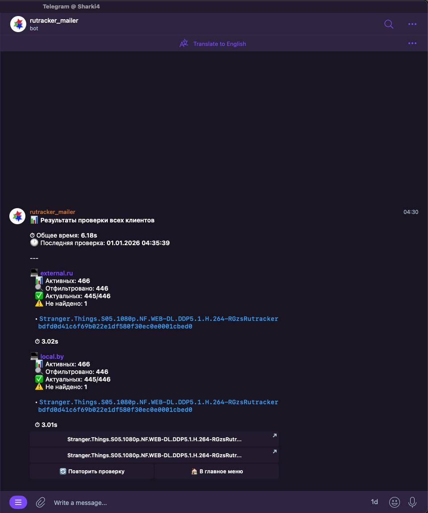

# CWS [](https://github.com/sharkboy-j/CWS/actions/workflows/go.yml)

**CWS** - Corpse Whore Searcher



Сервис для выявления "мёртвых" раздач с RuTracker в вашем торрент-клиенте qBittorrent. Предоставляет удобный Telegram-бот интерфейс для управления несколькими клиентами и автоматической/ручной проверки раздач.

## 🎯 Как это работает

1. Подключается к одному или нескольким экземплярам qBittorrent через Web API
2. Находит все раздачи, у которых есть трекер RuTracker
3. Для каждой раздачи проверяет наличие на RuTracker через API по хешу
4. Если раздача не найдена на трекере - она считается "мёртвой" (удалена/объединена/обновлена)
5. Извлекает ссылку на раздачу из комментария торрента (если доступна)
6. Отправляет уведомление с результатами проверки в Telegram

## ✨ Основные возможности

- 🔍 Автоматическая и ручная проверка раздач
- 👥 Поддержка нескольких клиентов qBittorrent на одного пользователя
- 💬 Удобный Telegram-бот интерфейс с интерактивными меню
- 🗄️ Хранение конфигурации клиентов в PostgreSQL
- ⏰ Настраиваемый интервал автоматической проверки
- 🔐 Поддержка HTTPS для подключения к qBittorrent
- 📊 Детальная информация по каждой "мёртвой" раздаче

## 📋 Требования

- PostgreSQL (версия 12+)
- qBittorrent с включенным Web UI
- Telegram Bot Token
- RuTracker API Token (можно получить в профиле на RuTracker, ну или не получить, походу не обязательно)

## 🚀 Быстрый старт

### Вариант 1: Docker Compose (рекомендуется)

1. Клонируйте репозиторий:
```bash
git clone https://github.com/sharkboy-j/CWS.git
cd CWS
```

2. Создайте файл `.env` в корне проекта (или экспортируйте переменные окружения):
```bash
TELEGRAM_TOKEN=your_telegram_bot_token
TELEGRAM_CHAT_ID=your_telegram_chat_id
RUTRACKER_API_TOKEN=your_rutracker_api_token
DB_HOST=your_postgres_host
DB_PORT=5432
DB_USER=postgres
DB_PASSWORD=postgres
DB_NAME=cws_db
DURATION_SECONDS=3600
ONLY_MANUAL_CHECK=false
LOG_LEVEL=INFO
```

3. При необходимости раскомментируйте и настройте секцию `postgres` в `docker-compose.yml` для локальной базы данных

4. Запустите сервис:
```bash
docker compose up -d
```

### Вариант 2: Сборка из исходников

1. Убедитесь, что у вас установлены Go 1.23+ и PostgreSQL

2. Клонируйте репозиторий:
```bash
git clone https://github.com/sharkboy-j/CWS.git
cd CWS
```

3. Установите зависимости:
```bash
go mod download
```

4. Создайте `config.json` (опционально, можно использовать только переменные окружения):
```json
{
  "telegram_token": "your_telegram_bot_token",
  "telegram_chat_id": 123456789,
  "rutracker_api_token": "your_rutracker_api_token",
  "rutracker_host": "https://api.rutracker.cc",
  "db_host": "localhost",
  "db_port": 5432,
  "db_user": "postgres",
  "db_password": "postgres",
  "db_name": "cws_db",
  "duration_seconds": 3600,
  "only_manual_check": false,
  "log_level": "INFO"
}
```

5. Запустите приложение:
```bash
go run main.go
```

## ⚙️ Конфигурация

Конфигурация может быть задана двумя способами:
1. **Переменные окружения** (имеют приоритет)
2. **Файл `config.json`**

### Переменные окружения

| Переменная | Описание | Обязательная | По умолчанию |
|------------|----------|--------------|--------------|
| `TELEGRAM_TOKEN` | Токен Telegram бота | Да | - |
| `TELEGRAM_CHAT_ID` | ID чата Telegram | Да | - |
| `RUTRACKER_API_TOKEN` | API токен RuTracker | Да | - |
| `RUTRACKER_HOST` | Хост API RuTracker | Нет | `https://api.rutracker.cc` |
| `DB_HOST` | Хост PostgreSQL | Нет | `localhost` |
| `DB_PORT` | Порт PostgreSQL | Нет | `5432` |
| `DB_USER` | Пользователь PostgreSQL | Нет | `postgres` |
| `DB_PASSWORD` | Пароль PostgreSQL | Нет | `postgres` |
| `DB_NAME` | Имя базы данных | Нет | `cws_db` |
| `DURATION_SECONDS` | Интервал автоматической проверки (секунды) | Нет | `3600` |
| `ONLY_MANUAL_CHECK` | Только ручная проверка (`true`/`false`) | Нет | `false` |
| `LOG_LEVEL` | Уровень логирования (`DEBUG`, `INFO`, `WARN`, `ERROR`) | Нет | `INFO` |

### Формат config.json

```json
{
  "telegram_token": "your_telegram_bot_token",
  "telegram_chat_id": 123456789,
  "rutracker_api_token": "your_rutracker_api_token",
  "rutracker_host": "https://api.rutracker.cc",
  "db_host": "localhost",
  "db_port": 5432,
  "db_user": "postgres",
  "db_password": "postgres",
  "db_name": "cws_db",
  "duration_seconds": 3600,
  "only_manual_check": false,
  "log_level": "INFO"
}
```

> **Примечание:** При использовании Docker Compose переменные окружения берутся из `.env` файла или из системы. Файл `config.json` также можно монтировать через volumes (см. `docker-compose.yml`).

## 🤖 Настройка Telegram бота

1. Создайте бота через [@BotFather](https://t.me/BotFather):
   - Отправьте команду `/newbot`
   - Следуйте инструкциям для создания бота
   - Сохраните полученный токен

2. Получите ваш Chat ID:
   - Напишите боту [@userinfobot](https://t.me/userinfobot)
   - Он отправит ваш ID (это и есть Chat ID)
   - Альтернативно: напишите любому сообщение вашему боту, затем используйте `https://api.telegram.org/bot<YOUR_TOKEN>/getUpdates` для получения chat_id

3. Активируйте бота:
   - Отправьте команду `/start` вашему боту
   - Это необходимо для того, чтобы бот мог отправлять вам сообщения

4. Добавьте токен и Chat ID в конфигурацию (см. раздел "Конфигурация")

## 📱 Команды Telegram бота

- `/start` или `/menu` - открыть главное меню
- `/check` - открыть меню проверки раздач
- `/clients` - управление клиентами qBittorrent

### Интерфейс бота

Бот предоставляет интерактивное меню для:
- 🔍 Проверки раздач (выборочно или все клиенты)
- 📋 Управления клиентами qBittorrent (добавление, редактирование, удаление)
- ➕ Добавления новых клиентов через диалог

## 🗄️ База данных

При первом запуске приложение автоматически:
- Создаст базу данных (если её нет)
- Применит все миграции
- Создаст необходимые таблицы

Структура базы данных:
- `clients` - хранение конфигурации клиентов qBittorrent
- `user_states` - хранение состояния пользователей для работы бота
- `schema_migrations` - отслеживание применённых миграций

## 🐳 Docker

### Использование готового образа

Образ доступен в GitHub Container Registry:
```bash
docker pull ghcr.io/sharkboy-j/cws:latest
```

### Сборка образа

```bash
# Сборка для текущей платформы
docker build -t cws .

# Сборка multi-arch образа (amd64 + arm64) с помощью buildx
make docker-build
```

### Публикация образа

```bash
# Сборка и публикация
make docker-build-push
```

## 📝 Roadmap

- [x] Уведомления в Telegram
- [x] Команда ручной проверки
- [x] Docker-контейнеризация
- [x] Запуск по таймеру
- [x] Поддержка нескольких клиентов
- [x] База данных для хранения конфигурации
- [x] Интерактивный Telegram-бот интерфейс
- [ ] Поддержка других торрент-клиентов (Transmission, Deluge и т.д.)
- [ ] Экспорт результатов проверки

## 🔧 Разработка

### Требования для разработки

- Go 1.23+
- PostgreSQL 12+
- Make (опционально, для использования Makefile)

### Сборка

```bash
# Сборка бинарника
go build -o cws ./main.go

# Запуск
./cws
```

### Тестирование

```bash
go test ./...
```

## 📄 Лицензия

См. файл [LICENSE](LICENSE)

## 🤝 Вклад

Pull requests приветствуются! Для крупных изменений сначала откройте issue для обсуждения предлагаемых изменений.

---

**Примечание:** Проект находится в активной разработке. API и конфигурация могут изменяться между версиями.
